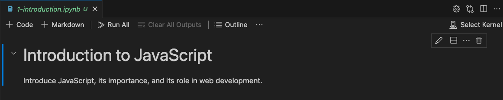
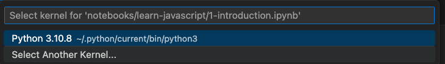
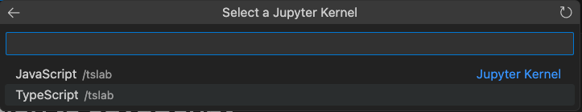
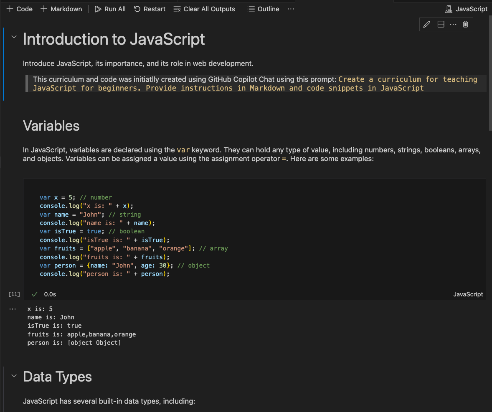
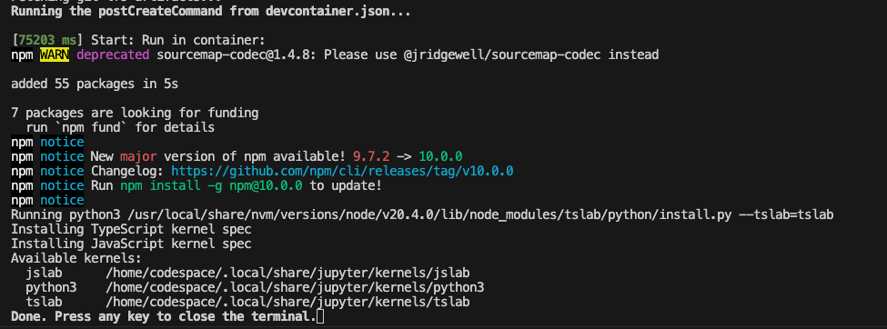

# Generative AI, Codespaces & Notebooks

<br/>

## Using: GitHub Codespaces

### 1. Update `requirements.txt` 

The `codespaces-jupyter` template sets up the default environment for  Jupyter Notebooks. Read about [using Jupyter Notebooks](https://docs.github.com/en/codespaces/developing-in-codespaces/getting-started-with-github-codespaces-for-machine-learning) on Codespaces for a quickstart.

The `devcontainer.json` file configures the Codespaces environment - installing Python packages defined in [`requirements.txt`](./../requirements.txt) into the container at startup. _I'll keep these updated to reflect DeepLearn.ai course dependencies - note that changing these files requires a container rebuild_.

### 2. Update `devcontainer.json` 

Some things we need to think about:
 - [Default env vars](https://docs.github.com/en/enterprise-cloud@latest/codespaces/developing-in-codespaces/default-environment-variables-for-your-codespace) - for Codespace (that you can create, read, modify)
 - [Persist custom env vars](https://docs.github.com/en/enterprise-cloud@latest/codespaces/developing-in-codespaces/persisting-environment-variables-and-temporary-files) - preset env values at codespace or repo levels
 - [Set env across ALL codespaces you create](https://docs.github.com/en/enterprise-cloud@latest/codespaces/developing-in-codespaces/persisting-environment-variables-and-temporary-files#for-all-codespaces-that-you-create) - using `dotfiles` repository.
 - [Prevent temp files being deleted](https://docs.github.com/en/enterprise-cloud@latest/codespaces/developing-in-codespaces/persisting-environment-variables-and-temporary-files#preventing-temporary-files-from-being-automatically-deleted) - by knowing `/workspaces` setup.
 - [Managing Encrypted Secrets](https://docs.github.com/en/enterprise-cloud@latest/codespaces/managing-your-codespaces/managing-encrypted-secrets-for-your-codespaces ) - attach secrets to repos, access as env.

_I'll update this section with the list of secrets that we will need to setup for DeepLearning.AI courses (e.g., OpenAI key)._

<br/>

## Using: GitHub Copilot

GitHub Copilot is described as `your friendly AI pair programmer`, offering suggestions and generating code in response to your prompts. Keep in mind that generated content may not always be correct, or optimal. 

I use it to _speed up development_ by automating repetitive tasks, _get code explanations_ for things I may be unfamiliar with, and _scaffold known project templates_ e.g., create Notebooks or Workspaces - giving me a starting point for exploration that I can then refine and validate for the actual problem at hand.

We can use Copilot in two modes:
1. The standard [Copilot](https://docs.github.com/en/copilot/getting-started-with-github-copilot) feature - with _inline_ suggestions in the editor.
1.  The [Copilot Chat](https://docs.github.com/en/copilot/github-copilot-chat/using-github-copilot-chat) extension - with a _standalone chat-based_ experience.

<br/>

## Using: Copilot Chat 

_**Caveat:** I'm using the Copilot Chat pre-release version which is subject to changes so YMMV based on latest updates._ 
 
Copilot Chat is interesting becuase it allows both free-form prompts (that you write from scratch) and some built-in `/<command>` prompts that have been tailored for specific use cases, including:

 - /createNotebook - create a Jupyter Notebook
 - /createWorkspace - scaffold code for new workspace
 - /explain - how code works
 - /extApi - help with VSCode Extension dev
 - /fix - suggest a fix for selected code in editor
 - /help - help me learn how to use Copilot Chat
 - /search - generate query parameters for workspace search
 - /simplify - simplify the selected code
 - /test - generate unit tests for the selected code
 - /vscode - ask questions about Visual Studio Code
 - /clear - clear the chat history

I'll primarily explore the `/createNotebook`, `/explain` and `/fix` prompts in these exercises. _Note that I a Polyglot with experience in multiple languages, but only a basic knowledge of Python. I'll be documenting my experiences in using Copilot as a JS developer skilling up on Python, Data Sciences and AI/ML_.

### 1. Notebook Creation For Prompt

The links show the prompt I used and a link to the initial notebook scaffolded by Copilot Chat. _These are not yet validated, but give a sense of how good Copilot can be at structuring a learning curriculum_.
 - /createNotebook Learn Python Fundamentals | [link](./00-learn-python-fundamentals.ipynb)
 - /createNotebook Learn Python Data Science Fundamentals | [link](./00-learn-python-datascience.ipynb)
 - /createNotebook Learn prompt engineering | [link](./01-learn-prompt-engineering.ipynb)

I'll run these next to see how well I can understand concepts and the effort needed to execute them in Codespaces - and correct any issues.

### 2. Notebook Creation For Courses

I need empty notebooks for the course so I can capture my own notes and complete the exercises. 

```bash
# Asking Copilot to create an empty notebook
/createNotebook Create an empty notebook with a title "ChatGPT Prompt Engineering For Developers"

# Result
...
GitHub Copilot
Sure! Here is an outline for a Jupyter notebook titled ChatGPT Prompt Engineering For Developers

# Followup: Copilot prompts me to ask 
What are some best practices for prompt engineering in ChatGPT? 
... 
GitHub Copilot
When it comes to prompt engineering in ChatGPT, here are some best practices to consider:

# Followup: Copilot prompts me to ask 
What are some common challenges in prompt engineering for ChatGPT?
...
Prompt engineering for ChatGPT can come with its own set of challenges. Here are some common challenges you may encounter:
```

I've added the responses into the [generated notebook](./01-chatgpt-prompt-engineering.ipynb) so we can revisit this later to compare-contrast the quality and coverage of the material with respect to the courses completed.

<br/>


## Using: tslab for JS/TS Notebooks

Jupyter Notebooks work on a two-process model based on a _kernel-client infrastructure_ as described in [this article](https://threathunterplaybook.com/tutorials/jupyter/introduction.html#how-do-jupyter-notebooks-work) with this illustration:


Clients (Notebook editors or UI) connect to a Jupyter Server (webserver hosting Notebook file) backed by a [Jupyter Kernel](https://jupyter-client.readthedocs.io/en/latest/kernels.html#kernels) (Notebook runtime). Client requests are forwarded to the kernel for processing; resulting changes to Notebook are persisted to file (at server) and reflected (at client). 

This means you can have the Notebook format work with other language kernels if they implement the right protocols - see available [Jupyter Kernel implementations](https://github.com/jupyter/jupyter/wiki/Jupyter-kernels). I'm trying out [tslab](https://github.com/yunabe/tslab) which appears to be an _actively maintained_ kernel for JS/TS/Node.js.

### 1. Installing tslab
Just [follow these guidelines](https://github.com/yunabe/tslab#installing-tslab) to install the kernels in our existing Codespace.

```bash
# Check default Jupyter kernels
$ jupyter kernelspec list
Available kernels:
  python3    /home/codespace/.local/share/jupyter/kernels/python3

# Install tslab
$ npm install -g tslab

# Verify it was installed
$ tslab install --version
tslab 1.0.21

# Register it with your Jupyter environment
$ tslab install --python=python3

Running python3 /usr/local/share/nvm/versions/node/v20.4.0/lib/node_modules/tslab/python/install.py --tslab=tslab
Installing TypeScript kernel spec
Installing JavaScript kernel spec

# Check updated Jupyter kernels listing
$ jupyter kernelspec list
Available kernels:
  jslab      /home/codespace/.local/share/jupyter/kernels/jslab
  python3    /home/codespace/.local/share/jupyter/kernels/python3
  tslab      /home/codespace/.local/share/jupyter/kernels/tslab

# Success 🎉
# You should now be able to select the JS or TS Kernel from your Jupyter Notebook.
```

### 2. Using tslab

Using the `tslab` kernel to run JavaScript notebooks is now as simple as (a) creating a new notebook with JS markdown and code, and (b) selecting the JavaScript kernel as the default for execution.

> 🤖 | I used GitHub Copilot to create a basic set of JavaScript exercises (with markdown descriptions and code snippets) for testing this. See the [Introduction to JavaScript](./learn-with-copilot/00-learn-javasscript-basics.ipynb) Notebook example.

1. Once created, open it up in VS Code and you should see something like this:

    

2. Click "Select Kernel" to get this drop down.

    

3. Pick the Jupyter Kernel option
    

4. Select the JavaScript kernel you just installed
    

5. Run the JavaScript Notebook exercises!

    

Note that `tslab` provides a _Node.js_ (or server-side JavaScript runtime) environment and does not support exploring HTML/CSS/JS application development. It is however a perfect way to learn 
 - the _syntax_ of JavaScript, TypeScript and Node.js
 - write server-side code talking to third-party APIs (e.g., OpenAI)
 - learn data structures and algorithms for competitive programming

### 3. Automating tslab install

The above steps were done in a running container. This means that any container rebuild will _remove_ these updates and will require you to reproduce them again. _How can we automate this on rebuild?_

Because this has a dependency on Jupyter, we need these commands to run _after_ the `pip install` process described in `devcontainer.json`. We can do this by adding these into a bash script (see `.devcontainer/post-create-updates.sh`) - then specifying this be run as the `postCreateCommand` in devcontainer configuration.

Let's try this by rebuilding the container. You should see something like this. 🎉 You now have JavaScript kernel support anytime you launch a new Codespace in this repo! (Note: Try validating this with both Docker Desktop and GitHub Codespaces environments!)



<br/>

## Learning: Course-Specific Notebooks

1. [ChatGPT Prompt Engineering for Developers](https://learn.deeplearning.ai/chatgpt-prompt-eng/lesson/1/introduction?_gl=1*m8i5g9*_ga*MTY2ODkwODkwOS4xNjgzMzk3NDY0*_ga_PZF1GBS1R1*MTY5MzU5MzcxNC45LjAuMTY5MzU5MzcxNC42MC4wLjA.) 👉🏽 See: [Notebooks](./chatgpt-prompt-engineering/).